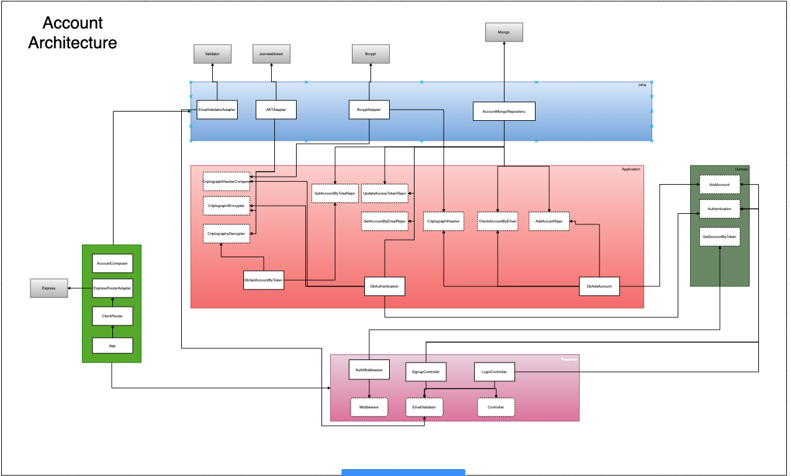
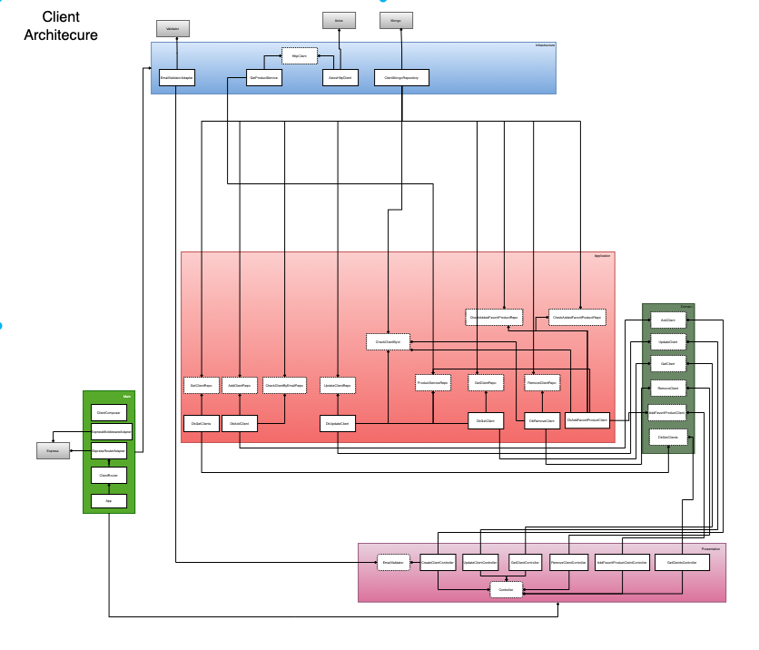

# Interview Magalu

## Tecnologies
 - Nodejs
 - Typescript
 - Express

## Principles
 - SOLID
    - Single Responsibility Principle (SRP)
    - Open Closed Principle (OCP)
    - Liskov Substitution Principle (LSP)
    - Interface Segregation Principle (ISP)
    - Dependency Inversion Principle (DIP)
 - Separation of Concerns (SOC)
 - You Aren't Gonna Need It (YAGNI)
 - Keep It Simple, Silly (KISS)
 - Small Commits

## Design Patterns
 - Factory
 - Adapter
 - Decorator
 - Dependency Injection
 - Builder

## Methodologies and tools
 - NPM
 - Typescript
 - Git
 - Docker
 - Jest
 - MongoDb
 - Mongoose
 - Bcrypt
 - JsonWebToken
 - Faker
 - Validator
 - Express
 - Supertest
 - Husky
 - Lint Staged
 - Eslint
 - In-Memory MongoDb Server

## Project

### Start project


#### 1 - Step
```
npm i
```

#### 2 - Step
 - You must to change to .env the file .env-example

#### 3 - Step
 - Starts MongoDb
```
docker-compose up -d
```
 - Starts application
```
npm run start:dev
```

### Routes
* Client Routes
> Create Client
  - POST `/api/client`
  - Params
    - name: string
    - email: string
  - Headers:
    - x-access-token: string

> Get Client
  - GET `/api/client/:id`
  - Params:
    - id: string
  - Headers:
    - x-access-token: string

> Get All Clients
  - GET `/api/client`
  - Params:
  - Headers:
    - x-access-token: string

> Update Client
  - PUT `/api/client/:id`
  - Params:
    - id: string
    - name: string
    - email: string
  - Headers:
    - x-access-token: string
> Delete Client
  - DELETE `/api/client/:id`
  - Params:
    - id: string
  - Headers:
    - x-access-token: string
> Add favorit product to client
  - POST `/api/client/product`
  - Params
    - clientid: string
    - productid: string
  - Headers:
    - x-access-token: string
---
* Account Routes
> SignUp in API
  - POST `/api/account/signup`
  - Params:
    - name: string
    - email: string
    - password: string
    - passwordConfirmation: string
> Login in API
  - POST `/api/account/login`
  - Params:
    - email: string
    - password: string

### Execution
 - Signup in application using the route `/api/account/signup`
 - Get `accessToken`
 - Set in header using the param `x-access-token`
 - Now you can using the routes

### Run tests

 - Run all tests (unit, integration)
```
npm run test
```
 - Run unit tests
```
npm run test:unit
```
- Run integration tests
```
npm run test:integration
```

### Run in dev
```
npm run start:dev
```

### Architecture

 - Account Architecture

 - Client Architecture


### Examples how to use API
[POSTMAN-Interview-Examples](MagaluWishilist.postman_collection.json)
